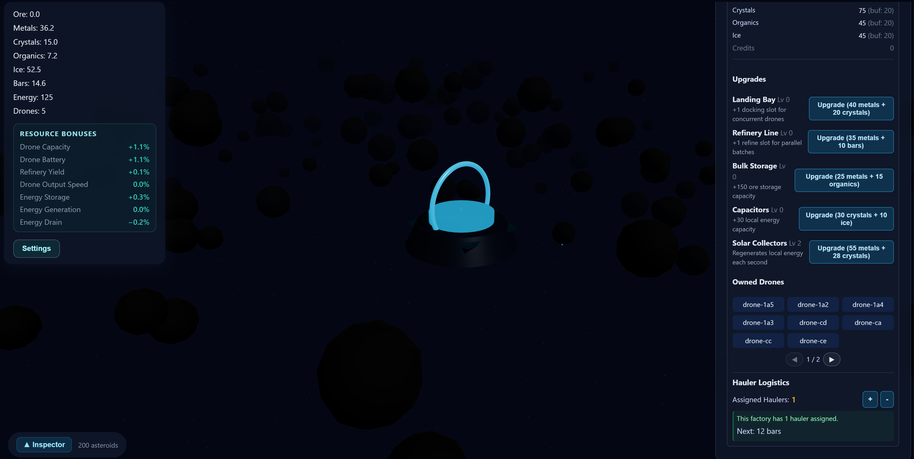

# Mining Drones Idle

Mining Drones Idle is a small idle/automation prototype built with React, Three.js, and an ECS-driven simulation loop. The factory mines asteroids, refines ore into bars, and gradually unlocks upgrades through prestige resets.



This repository contains the interactive UI, simulation logic, and persistence utilities used by the prototype.

## Getting started

```bash
npm install
npm run dev
```

The app runs on Vite with hot module replacement. To build or preview production assets:

```bash
npm run build
npm run preview
```

## Core systems

### Factories & upgrades

Factories are the primary production centers. Each factory has configurable upgrades including:

- **Docking Bay** – Increases drone capacity and travel speed
- **Refinery** – Boosts bar production output
- **Storage** – Expands local ore capacity
- **Energy** – Increases energy capacity
- **Solar Array** – Provides passive energy regeneration

Upgrades use exponential cost scaling (1.15× multiplier per level) to create meaningful progression milestones.

### Hauler logistics

A reservation-based hauler scheduling system manages resource distribution across the factory network:

- **Hauler assignment** – Assign drones to factories for hauling duties. Each hauler has configurable capacity, speed, and resource filters.
- **Automatic matching** – The scheduler matches factories with resource surplus to factories with resource need every 2 seconds. Transfers respect minimum reserves to keep factories operational.
- **Warehouse integration** – Surplus resources are exported to the global warehouse when factories exceed their target buffer. Conversely, factories import from the warehouse when below their target to maintain optimal production.
- **Per-resource buffers** – Each resource type has a consumption-based target (e.g., ore buffers account for refinery slot count). The system prevents starvation while avoiding wasteful overstock.
- **Transfer tracking** – Active, scheduled, and completed transfers are displayed in the Logistics Panel with ETAs and resource amounts. Pagination ensures the UI remains stable.

### Warehouse

The global warehouse stores surplus resources:

- **Automatic exports** – When a factory produces more than its buffer target, excess flows to the warehouse via hauler transfers.
- **Automatic imports** – When a factory falls below its target, the warehouse ships resources back (subject to available hauler capacity).
- **Capacity upgrades** – Warehouse modules expand storage to hold more of each resource type.
- **Resource reconciliation** – On load, the warehouse rebalances based on current factory needs to maintain optimal distribution.

### Energy throttling

Each drone tracks its own battery and drains power while travelling or mining. The drain rate scales with the configured "Throttle floor": the lower the battery, the slower the drone moves and mines, but progress never drops below the floor unless the player explicitly sets it to zero. The power system converts the factory's stored energy and solar generation into per-drone charging whenever drones are docked, keeping energy values non-negative and smoothing out bursts of demand. Dedicated unit tests cover mining, travel, and power behaviour under drained and replenished batteries.

Player progress is stored in `localStorage` using the `space-factory-save` key. Persistence is handled by the `PersistenceManager` that boots alongside the Zustand store.

- **Autosave** – Enabled by default and configurable from the Settings panel. The interval respects the slider value (minimum 1 second) and pauses automatically if storage is unavailable.
- **Offline simulation** – When a save is loaded, the manager computes the elapsed time since the last save, clamps it to the configured offline cap, and replays refinery ticks through the same `processRefinery` path used in real-time play.
- **Import/Export** – Manual backups are available from Settings. Export generates a timestamped JSON download. Import validates the payload, applies store migrations, refreshes autosave, and reports errors inline without dropping the current save.
- **Migrations** – Snapshots store a semantic `save.version`. New fields (for example, throttle settings or RNG seeds) are normalized when loading older saves so existing progress continues to work without manual intervention.

### Save format & migration strategy

Saves are JSON snapshots stored under the `space-factory-save` key in `localStorage`. The shape is described by the `StoreSnapshot` TypeScript type in `src/state/store.ts` and includes:

- `resources` — ore, bars, energy, credits
- `modules` — counts for droneBay, refinery, storage, solar, scanner
- `prestige` — prestige cores
- `settings` — user-configurable options (autosave, offline cap, notation, throttleFloor, showTrails)
- `save` — metadata (lastSave timestamp and `version` string)
- `rngSeed` — optional numeric seed for deterministic RNG
- `droneFlights` — optional array describing active drone trips (target asteroid, path seed, travel progress)

Versioning and migration strategy:

- Each snapshot includes a `save.version` string. The current runtime exports saves with the repository `saveVersion` (see `src/state/store.ts`).
- On load and on import, the `PersistenceManager` parses the snapshot and runs the migration pipeline (`src/state/migrations.ts`) before applying the snapshot to the live store.
- Migrations are additive and idempotent. The migration pipeline ensures new fields get safe defaults (for example, `settings.showTrails` defaults to `true`) and updates `save.version` to the current version on successful migration.
- When making breaking changes to the save shape, add a small migration function to `src/state/migrations.ts` that detects older `save.version` values and upgrades the payload step-by-step. Keep the migration logic minimal and test-backed.

Troubleshooting:

- If import fails with a parse error, check that the exported JSON is intact (no trailing text or formatting from editors). Use the Settings > Export to create a clean backup.
- If older saves produce unexpected values, open an issue and include the exported payload; maintainers can add a migration test for the specific legacy format.

## Deterministic RNG seeds

Each save stores a `rngSeed` value. Fresh games generate a seed using `crypto.getRandomValues` (falling back to `Math.random` if necessary). A Mulberry32-based utility feeds world generation and math helpers so asteroid placement and other random-driven systems are reproducible. Exported saves include the seed, and importing that payload restores the same layout. Seeds that are missing from older snapshots are regenerated automatically.

## Testing & quality checks

The project uses Vitest, ESLint, and TypeScript project references.

```bash
npm run test        # unit tests
npm run lint        # ESLint rules
npm run typecheck   # TypeScript project references
```

Playwright end-to-end tests are available with `npm run e2e` after running `npm run build`.

Prettier (with the Tailwind plugin) enforces formatting via `npm run format`.

## Documentation

For a comprehensive overview of the game's architecture and how all systems work together, see [docs/ARCHITECTURE.md](docs/ARCHITECTURE.md).

For local Rust/WASM development and live-rebuild instructions, see [docs/rust-wasm-dev.md](docs/rust-wasm-dev.md).
