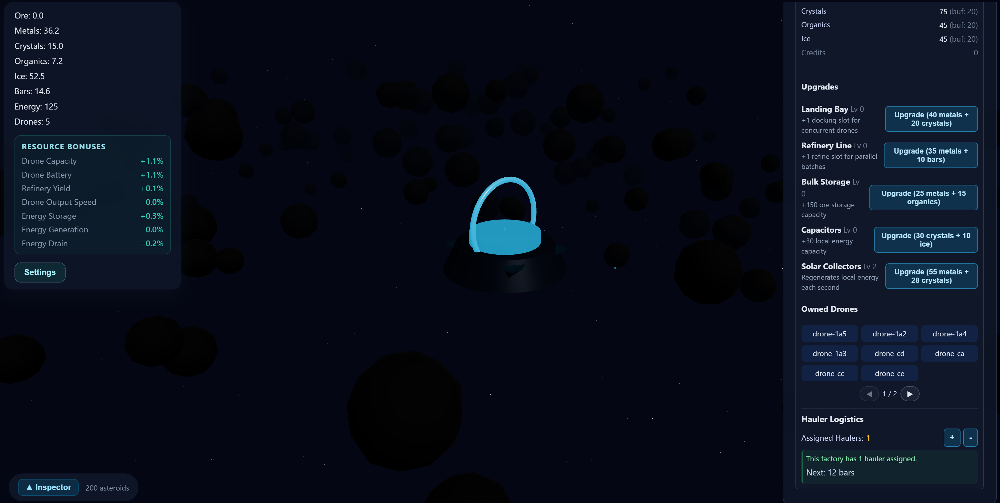

# Mining Drones Idle

A production-ready idle/automation game built with React, Three.js, and an ECS-driven simulation loop. Manage factories, deploy fleets of mining drones, optimize logistics, and expand your industrial empire across the asteroid belt.



## 🚀 Features

*   **Interactive 3D World**: Fully rendered asteroid fields, factories, and drone fleets using React Three Fiber.
*   **Deep Simulation**: ECS-based logic for mining, logistics, power management, and refining.
*   **Factory Automation**: Manage production chains, upgrade modules, and balance energy grids.
*   **Logistics Network**: Smart hauler scheduling system to distribute resources between factories and the central warehouse.
*   **Progression System**: Unlock upgrades, expand to new factories, and prestige to gain powerful cores.
*   **Offline Progress**: Simulation continues even when you're away, calculating production and mining yields.
*   **Hybrid Engine**: TypeScript-based simulation with an optional high-performance Rust/WASM engine backend.

## 🛠️ Tech Stack

*   **Frontend**: React 19, TypeScript, Vite
*   **3D Graphics**: Three.js, React Three Fiber (R3F), Drei
*   **State Management**: Zustand, Immer
*   **Simulation**: Miniplex (ECS), Custom Rust Engine (WASM)
*   **Styling**: Tailwind CSS, Radix UI Themes
*   **Testing**: Vitest, Playwright, React Testing Library

## 📦 Getting Started

### Prerequisites

* Node.js 22+
* pnpm 10+
* Rust (optional, for compiling the WASM engine)

### Installation

1. **Clone the repository**:

    ```bash
    git clone https://github.com/your-username/mining-drones-idle.git
    cd mining-drones-idle
    ```

2. **Enable Corepack** (once per machine, if `pnpm` is not already installed):

    ```bash
    corepack enable
    ```

3. **Install dependencies**:

    ```bash
    pnpm install
    ```

4. **Start the development server**:

    ```bash
    pnpm dev
    ```

    Open [http://localhost:5173](http://localhost:5173) in your browser.

### Building for Production

To create an optimized build for deployment:

```bash
pnpm build
```

The output will be in the `dist/` directory. You can preview it locally with:

```bash
pnpm preview
```

### Rust/WASM Engine (Optional)

To work on the Rust simulation engine:

1. Ensure you have Rust installed (see [rustup.rs](https://rustup.rs)).
2. Install `wasm-pack` (recommended via `cargo`):

    ```bash
    cargo install wasm-pack
    wasm-pack --version
    ```

    Or run the included checker:

    ```bash
    pnpm run check:wasm-pack
    ```

3. Run the WASM build in watch mode:

    ```bash
    pnpm run dev:wasm:watch
    ```

    This runs concurrently with `pnpm dev` if you use the main start script.

> Note: If you see an "Unsupported platform" error during `pnpm install` (common on Windows ARM64), installing `wasm-pack` via `cargo install wasm-pack` or building in WSL/x64 avoids the failing package-manager postinstall step that downloads a prebuilt binary.

## 🧪 Testing

We maintain a high standard of code quality with comprehensive test coverage.

* **Unit Tests**:

    ```bash
    pnpm test
    ```

* **Type Checking**:

    ```bash
    pnpm typecheck
    ```

* **Linting**:

    ```bash
    pnpm lint
    ```

* **End-to-End Tests**:

    ```bash
    pnpm e2e
    ```

## 📖 Documentation

* [**Architecture Overview**](docs/ARCHITECTURE.md): detailed breakdown of the system design, data flow, and key subsystems.
* [**Rust Engine Development**](docs/rust-wasm-dev.md): guide for working with the Rust/WASM simulation backend.

## 🎮 How to Play

1. **Mining**: Drones automatically launch from your factory to mine nearby asteroids.
2. **Refining**: Ore is brought back and refined into Bars in the Refinery.
3. **Upgrading**: Use Bars and other resources to upgrade your Factory modules (Docking, Refinery, Storage, etc.).
4. **Logistics**: As you build more factories, use Haulers to move resources where they are needed.
5. **Prestige**: Reset your progress to gain Cores, which provide permanent boosts to your empire.

## 🤝 Contributing

1. Fork the repository.
2. Create a feature branch (`git checkout -b feature/amazing-feature`).
3. Commit your changes (`git commit -m 'Add amazing feature'`).
4. Push to the branch (`git push origin feature/amazing-feature`).
5. Open a Pull Request.

## 📄 License

This project is licensed under the MIT License - see the [LICENSE](LICENSE.md) file for details.
