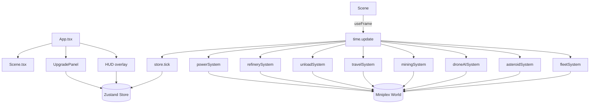

# DES001 - Core MVP Implementation

**Status:** Draft  
**Updated:** 2025-02-14

## Overview

Implement the initial playable slice aligning with requirements RQ-001 through RQ-005. The application will combine a Zustand-based economy store, a Miniplex ECS world for drones/asteroids, and React components (including React Three Fiber scene) to visualize the simulation and present upgrade/prestige controls.

## Architecture Diagram



## Data Flow

1. `Scene.tsx` obtains `gl.clock.getDelta()` each frame, feeds to `time.update` (fixed step of 0.1s).
2. Each fixed update triggers ECS systems in deterministic order and calls `store.tick(step)` for economy conversion.
3. ECS systems mutate entities in `world`, reading upgrade multipliers from the store via selectors or passed context.
4. UI components subscribe to store slices to render resource totals, module levels, and prestige info.
5. Player interactions (upgrade buttons, prestige action) call store actions, influencing subsequent simulation ticks.

## Key Interfaces

```ts
// state/store.ts
interface Resources {
  ore: number;
  bars: number;
  energy: number;
  credits: number;
}
interface Modules {
  droneBay: number;
  refinery: number;
  storage: number;
  solar: number;
  scanner: number;
}
interface Prestige {
  cores: number;
  bonus(): number;
}
interface Store {
  resources: Resources;
  modules: Modules;
  prestige: Prestige;
  addOre(amount: number): void;
  buy(id: keyof Modules): void;
  tick(dt: number): void;
  prestigeReady(): boolean;
  preview(): number;
  doPrestige(): void;
}

// ecs/world.ts
interface Drone {
  id: string;
  position: Vector3;
  state: 'idle' | 'toAsteroid' | 'mining' | 'returning' | 'unloading';
  targetId: string | null;
  cargo: number;
  speed: number;
  capacity: number;
  progress: number;
}

interface Asteroid {
  id: string;
  position: Vector3;
  oreRemaining: number;
  richness: number;
  radius: number;
}
```

## Error Handling

- Systems guard against missing target entities by resetting drone state to `idle`.
- Purchasing modules ensures sufficient bars; otherwise action is no-op.
- Prestige action double-checks threshold before mutating state.

## Testing Strategy

- Vitest specs for store economy (`state/store.test.ts`), fleet adjustments (`ecs/systems/fleet.test.ts`), scanner richness (`ecs/systems/asteroids.test.ts`), and prestige.
- Playwright e2e verifying HUD updates and upgrade unlocking.

## Task Breakdown

Refer to task `TASK001-core-mvp` for detailed implementation plan and sequencing.
