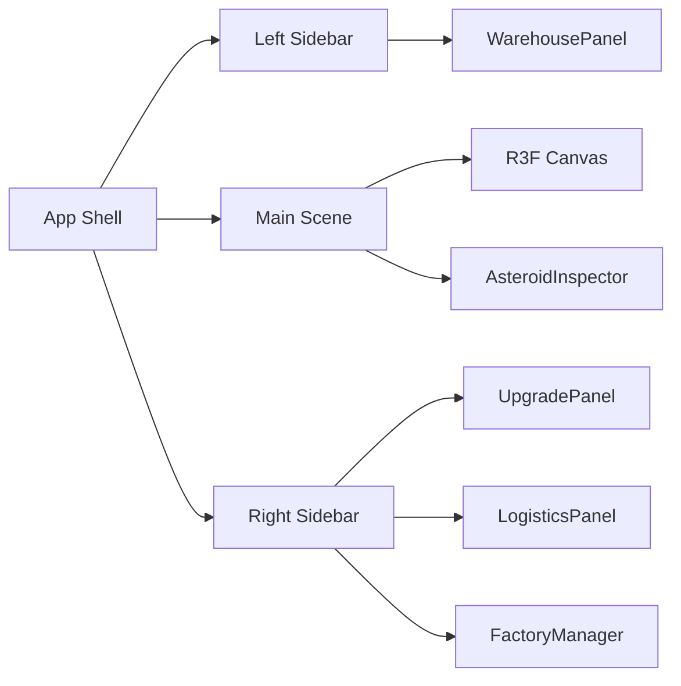

## DES041 Shadcn UI Shell Overhaul

### Summary

Refresh the game shell to use a shadcn-inspired layout with nested, collapsible sidebars framing the central R3F canvas, while keeping existing panels intact inside the new shell.

### Architecture

- `App` owns layout state for left/right sidebar collapse.
- `SidebarSection` provides a reusable collapsible section for nested groups.
- Existing panel components render inside shadcn-styled containers.

### Data Flow

- UI-only state (`leftCollapsed`, `rightCollapsed`, `settingsOpen`) remains local to `App`.
- Simulation data still flows from Zustand store into panels and overlays.

### Interfaces

- `SidebarSection` props: `title`, `description`, `defaultOpen`, `children`.
- `App` provides `onOpenSettings` callback to `WarehousePanel`.

### Styling

- `styles.css` defines shell tokens, sidebar group styles, and main scene header styles.
- Panels retain their existing class structure but inherit the new shadcn-like surfaces.
